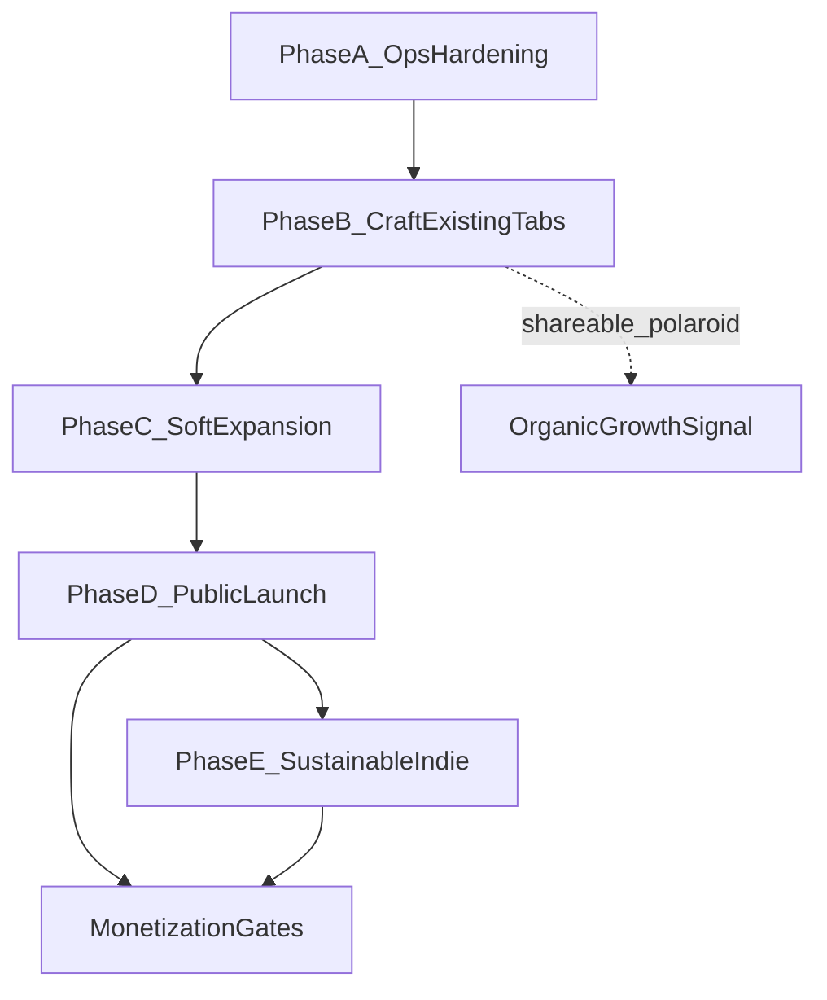

# Bloomlog — Product Roadmap

**Companion doc:** [ACHIEVEMENTS.md](./ACHIEVEMENTS.md) (what exists today)  
**Setup:** [README.md](../README.md)  
**Production:** https://bloomlog-six.vercel.app  
**Last updated:** May 2026

This roadmap pitches ideas for making Bloomlog a successful product **without diluting its core**. Every phase is optional until you choose it; nothing here overrides the calm contract.

---

## How to read this doc

| Horizon | Focus |
|---------|--------|
| **0–2 weeks** | Ops hardening — trust, sync, deploy hygiene |
| **2–6 weeks** | Craft on existing tabs — depth, not breadth |
| **6–12 weeks** | Soft expansion — photos, recipes, calm budgets, alpha study |
| **3–6 months** | Public launch loops — accounts, growth, positioning |
| **6–12 months** | Sustainable indie — monetization, wrappers, careful social |

Phases stack: **A → B → C → D → E**. You can pause between phases and run the alpha study during B or C.

---

## 1. Core anchors (the line we won't cross)

These are **non-negotiables** derived from the product vision in [ACHIEVEMENTS.md](./ACHIEVEMENTS.md). If an idea conflicts with any row below, it does not ship (or ships only as an opt-in layer behind a tap).

| Anchor | What it means in practice |
|--------|-------------------------|
| **No streaks, no guilt** | No day counters, no “you missed yesterday,” no red badges. Copy stays invitational (“still here,” “when you're ready”). |
| **~60-second Today ritual** | Mood + water + optional tiny win is the spine. New UI must **shorten** the ritual or live **behind an explicit tap** (pattern: collapsible “this month, softly” in `spend-bubbles.tsx`). |
| **Mood-as-weather** | Seven skies stay the emotional language; features extend weather, not replace it with scores. |
| **Offline-first** | Guest mode + `localStorage` remain fully functional. Cloud is a upgrade path, not a requirement. See `src/lib/data/auth.ts`. |
| **Privacy-first** | Allowlisted PostHog events only (`src/lib/analytics/posthog.ts`). Export + delete in Settings stay first-class. |
| **Gentle motion** | Framer Motion + reduced-motion guards. No autoplay chaos, no slot-machine dopamine outside the intentional spend wheel. |
| **No feed, no leaderboard** | Growth and social features are **private rooms** or **one-way gifts**, never infinite scroll. |

**Design test for any feature:** *Would this still feel like a windowsill at 9pm, not a productivity app?*

---

## 2. What we have today (baseline)

Before building forward, the shipped baseline (detail in [ACHIEVEMENTS.md](./ACHIEVEMENTS.md)):

- **Today:** mood sky, whispers (in-flow, 1/day), water bottle, spend bubbles + collapsible monthly donut, meals, sleep, tiny quests, one-line note  
- **Garden:** decor from quest rewards; empty-state guidance; `bloom_stage` in schema but not progressed in UI  
- **Shelf:** polaroid stack; weekly recap edge function exists but UI is mostly local preview  
- **Recipes:** 20 static recipes  
- **Settings:** day/night theme, cozy-hour push stub, finance toggle, export/delete  
- **Infra:** Vercel production, Supabase schema + RLS, dual storage with guest fallback  

**Known gaps:** anonymous auth often disabled in dashboard, preview env vars incomplete, PWA cache can stale, no custom domain yet, alpha study process documented but not in-app.

---

## 3. Calm-shaped success metrics

Avoid vanity metrics that pressure users. Measure **product health** and **felt calm**.

| Metric | Definition | Target (alpha) | Why it matters |
|--------|------------|----------------|----------------|
| **Soft return** | User opens app on ≥3 distinct days in a 7-day window | ≥40% of cohort week 2 | Habit without streak UI |
| **Ritual completion time** | Median time from open → mood set + one other action | ≤75s | Core promise |
| **Whisper helpfulness** | Optional 1-tap “that landed” / “skip” after whisper | ≥50% positive when shown | Copy quality signal |
| **Polaroids / month** | Auto or manual memory cards on shelf | ≥1 per active user by week 4 | Long-term emotional hook |
| **Garden pieces / user** | Decor items acquired | ≥3 by week 4 | Reward loop working |
| **Data trust** | % sessions with successful write (local or cloud) | ≥99% | Fixes “nothing works” class of bugs |
| **Alpha one-word** | Weekly in-app prompt: “opening bloomlog felt ___” | Qualitative themes | README alpha study |

**Explicitly not tracking:** streak length, leaderboard rank, time-on-app maximization, notification open-rate gamification.

---

## 4. Phase A — Operational hardening (0–2 weeks)

**Goal:** Make production trustworthy so alpha feedback is about the product, not broken pipes.

| Initiative | Description | Primary touchpoints |
|------------|-------------|-------------------|
| **Enable Supabase anonymous auth** | Turn on Anonymous sign-ins + redirect URLs for production and localhost | Supabase dashboard; [README.md](../README.md) |
| **Preview env vars** | Add `NEXT_PUBLIC_SUPABASE_URL`, `NEXT_PUBLIC_SUPABASE_ANON_KEY` to Vercel Preview | Vercel project settings |
| **PWA update toast** | When service worker updates, show a soft “fresh petals available — refresh” banner | `src/components/providers/app-providers.tsx` |
| **PostHog (optional)** | Set `NEXT_PUBLIC_POSTHOG_KEY` on production; one line in Settings: “help us improve anonymously” with off-by-default or soft opt-in | Settings, `posthog.ts` |
| **Custom domain** | Point `bloomlog.app` → Vercel; set `NEXT_PUBLIC_APP_URL` | Vercel DNS, env |
| **Achievements doc hygiene** | Keep [ACHIEVEMENTS.md](./ACHIEVEMENTS.md) updated per release | Docs only |

**Exit criteria:** New user on production can complete onboarding, log mood/water/quest, see data after refresh; optional sync works when anonymous auth is on.

---

## 5. Phase B — Craft on existing tabs (2–6 weeks)

**Goal:** Deepen emotional payoff on **Today**, **Garden**, and **Shelf** without adding nav tabs.

### 5.1 Garden: bloom progression

- Use existing `bloom_stage` (0–3) on `garden_items`.
- Advance stage by **days since acquired** (e.g. 0 → 1 → 2 → 3 over 7/14/30 days), not by streaks.
- Visual: opacity + scale already in `garden-room.tsx`; tie to computed stage on read.
- Copy on stage-up: one whisper-style line (“your fern unfurled a little”).

**Files:** `src/components/garden/garden-room.tsx`, `src/lib/data/api.ts` (`getGardenItems` enrich), migration optional if stage stored vs derived.

### 5.2 Shelf: real weekly recap

- Wire `supabase/functions/weekly_recap` to run on schedule (Sunday evening user-local or UTC).
- Write `memory_polaroids` row; client fetches on Shelf open.
- Replace “preview a cozy polaroid” dev button with “your week arrived” when polaroid exists.
- Guest mode: generate recap locally from last 7 `daily_entries` + quests.

**Files:** `supabase/functions/weekly_recap/index.ts`, `src/app/(app)/shelf/page.tsx`, `src/components/shelf/memory-shelf.tsx`.

### 5.3 Shelf: shareable polaroid (organic growth)

- Export top polaroid as PNG (client-side canvas / html-to-image).
- No server upload required; user shares via OS sheet.
- Watermark: small “bloomlog” + date, not UTM spam.

**Files:** `memory-shelf.tsx`, new `lib/export/polaroid-image.ts`.

### 5.4 Whispers v2

- Expand library from ~80 → ~200 lines in `src/lib/whispers/library.ts`.
- **Room-aware tone:** windowsill / balcony / nook variants for shared triggers.
- New triggers: `weekend`, `late_night` (after 22:00 local).
- Keep cap: **1 whisper per day**; no re-fire on mood/water change.

**Files:** `library.ts`, `picker.ts`, `use-whisper.ts`.

### 5.5 Today: last 7 skies

- Thin horizontal strip below greeting: last 7 days’ mood emojis/gradients.
- Tap a day → optional read-only mini card (mood, water, note snippet). No editing past days from here in v1.
- Collapsed by default on first visit; remember preference in profile or local.

**Files:** new `components/mood/mood-horizon.tsx`, `dashboard/page.tsx`, `getDailyEntry` range helper in `api.ts`.

**Phase B exit criteria:** Alpha users mention garden/shelf unprompted; median ritual time still ≤75s; no new top-nav tabs.

---

## 6. Phase C — Soft expansion (6–12 weeks)

**Goal:** Round out the lifestyle loop while keeping Today fast.

| Initiative | Description | Guardrail |
|------------|-------------|-----------|
| **Meal photos** | Supabase Storage upload from meal sheet; thumbnail on timeline | Photos optional; never required for log |
| **Sunday recipe surprise** | One hero recipe on Sundays; mood hint (stormy → soup) | Recipes tab only; no push spam |
| **Calm budgets** | Optional per-category soft ceiling in month panel; gentle tint when crossed | Never block logging; copy: “just a shape” |
| **In-app alpha prompt** | Weekly one-word feeling; stored locally, exportable in study CSV | Dismiss forever option |
| **Landing v2** | `bloomlog.app`: single scrolling mood demo + waitlist; `/welcome/<code>` for alpha | Marketing separate from app ritual |
| **Letter mode (exploratory)** | Auto-save one-line note as running “letters” collection on Shelf | Opt-in in Settings |

**Meal photos note:** Prefer Supabase Storage over R2 for fewer secrets (`.env.example` R2 keys become optional legacy).

**Phase C exit criteria:** 15 alpha users complete 4-week diary; qualitative themes + calm metrics above; finance + meals used by ≥30% without ritual time regression.

---

## 7. Phase D — Public launch loops (3–6 months)

**Goal:** Grow reach without becoming a social network.

### 7.1 Identity and sync

| Feature | Pitch |
|---------|--------|
| **Magic-link email** | Guest → account; merge `localStorage` into Supabase on first sign-in |
| **QR device pair** | Scan on second phone; same anonymous or email account |
| **Migration UX** | “your garden is moving to the cloud” — one screen, no data loss |

### 7.2 Calm growth (not virality)

| Loop | Mechanism |
|------|-----------|
| **Shareable polaroid** | Phase B asset; primary organic channel |
| **Invite codes** | `/welcome/<code>` from landing; track redemption, not referrals leaderboard |
| **Press / positioning** | “Calm tech for days that don't need fixing” — Product Hunt, slow living newsletters |
| **PWA install prompt** | After 3rd soft return; “add to home screen” once |

### 7.3 Product depth

| Feature | Pitch |
|---------|--------|
| **Mood-aware cozy hour** | Push copy matches last mood (rainy → “tea weather”) |
| **Garden seasons** | Subtle palette shift by calendar month (desaturated winter) |
| **Decor sets** | Themed drops (monsoon afternoon, golden hour pack) via quests or keeper tier |
| **iOS PWA push** | Leverage 16.4+; document limitations in FAQ |

### 7.4 Companion (exploratory, high care)

- **Send a teacup:** one-tap gift to a friend (predefined emoji/item, no message body).
- No feed, no reply thread, no read receipts.
- Requires accounts + moderation story before ship.

**Phase D exit criteria:** Waitlist → 500+ installs; D7 soft return ≥25%; sync adoption ≥50% of actives; zero “streak guilt” feedback in surveys.

---

## 8. Phase E — Sustainable indie (6–12 months)

**Goal:** Revenue funds craft, free tier stays honest.

### 8.1 Monetization (Overcast-style, not Headspace-style)

| Offering | Includes | Tone |
|----------|----------|------|
| **Free** | Full offline ritual, guest mode, basic garden, 20 recipes | Always |
| **Teacup (one-time)** | Cloud sync, extra room themes, full cookbook export, letter mode | “buy us a teacup” |
| **Windowsill keeper (yearly)** | New decor sets, whispers packs, seasonal skies | “keep the room tended” |

**Rules:** No ads. No dark patterns. No paywall on mood/water/quests. Upsell only in Settings or after positive moment (polaroid created), never on bad days.

### 8.2 Platform wrappers

- **Capacitor** shell for App Store / Play when PWA limits bite (push, install friction).
- **Live Activity (iOS):** cozy hour reminder on lock screen — minimal, no gamification.

### 8.3 Health and data

- **Apple Health / Health Connect:** read sleep or mindfulness minutes, opt-in, deletable.
- **Personal API:** read-only JSON export URL for power users (API key in Settings).

### 8.4 Bloom Together (only if core holds)

- Private room: 1–6 friends, invite-only.
- Visible: mood weather avatar only + optional 1-tap reaction (🍵, 🌸).
- Never: chat, feed, streaks, comparisons.

### 8.5 Content engine

- Ambient sound loops (rain on window, kettle) — 60s max, off by default.
- Breathing card: one pattern, no streak.
- Partner with illustrators for decor / polaroid frames (revenue share).

**Phase E exit criteria:** MRR covers hosting + one part-time content; NPS among payers ≥50; core metrics unchanged vs Phase D.

---

## 9. Idea backlog (unscheduled)

Ideas that fit the brand but need more discovery:

- **Soundscape tied to mood sky** (mute by default)
- **Printed polaroid mail** (physical goods, high ops cost)
- **Widget / glance** (today’s mood on home screen)
- **Watch complication** (water reminder only)
- **Localized whispers** (Hindi + English first)
- **School / workplace “quiet hour”** B2B — only if zero surveillance vibe

Park until a phase owner and user research exist.

---

## 10. Risks and guardrails

| Risk | Mitigation |
|------|------------|
| Feature creep breaks 60s ritual | Default pattern: collapsible section; say no to new bottom-nav tabs |
| Streak envy by accident | Code review: no consecutive-day UI; use “still here” |
| Monetization feels preachy | Tip-jar copy; test with alpha before paywall |
| iOS PWA ceiling | Document limits; ship Capacitor only when blocked |
| Social becomes toxic | Bloom Together ships last; max 6 people; no text |
| Guest/cloud split brain | Phase A auth + Phase D migration as priority |
| AI slop whispers | Human-written library only; no LLM daily copy in v1 |

---

## 11. Prioritization matrix

When choosing what to build next, score 1–5 on:

1. **Core integrity** — Does it respect no-streak / 60s / calm?  
2. **Alpha signal** — Will 15 users notice in week 1?  
3. **Effort** — Small (S) / Medium (M) / Large (L)  
4. **Revenue path** — None / indirect / direct  

| Initiative | Core | Alpha | Effort | Revenue |
|------------|------|-------|--------|---------|
| Phase A ops | 5 | 5 | S | — |
| Bloom progression | 5 | 4 | M | — |
| Weekly recap | 5 | 5 | M | — |
| Shareable polaroid | 4 | 5 | S | indirect |
| Last 7 skies | 5 | 3 | M | — |
| Meal photos | 4 | 3 | M | — |
| Magic-link sync | 4 | 4 | L | direct |
| Teacup IAP | 5 | 2 | L | direct |

**Recommended default order:** Phase A → bloom progression + weekly recap + shareable polaroid → alpha study → Phase C meal photos + calm budgets → Phase D accounts → Phase E teacup IAP.

---

## 12. Alpha study playbook (4 weeks)

Aligns with [README.md](../README.md).

| Week | Focus | Ship / measure |
|------|--------|----------------|
| 1 | Onboarding + first ritual | Ritual time, data trust |
| 2 | Quests + garden | Garden pieces, whisper sentiment |
| 3 | Finance + month panel | Spend logs, month expand rate |
| 4 | Shelf + recap | Polaroids, one-word feeling |

**Weekly question (in-app Phase C):** *“How did opening Bloomlog make you feel today?”* — one word, optional.

**Synthesis:** Tag responses (calm, confused, guilty, delighted). If “guilty” >10%, stop ship and audit copy.

---

## 13. Documentation map

| Doc | Purpose |
|-----|---------|
| [ACHIEVEMENTS.md](./ACHIEVEMENTS.md) | As-built system, deploy state, file index |
| **ROADMAP.md** (this file) | Where we're going; ideas and phases |
| [README.md](../README.md) | Setup, env, deploy commands |
| [AGENTS.md](../AGENTS.md) | Next.js conventions for contributors |

When shipping a phase, update ACHIEVEMENTS §11 and the git milestone table; add a one-line entry to this doc’s phase exit criteria if met.

---

## 14. Summary pitch

Bloomlog wins by being the **anti-productivity** daily room: mood as weather, tiny wins as decor, memory as polaroids—not charts that judge you. The roadmap invests first in **trust and craft** (sync, garden growth, real recaps, shareable moments), then **soft lifestyle depth** (photos, recipes, calm budgets), then **calm growth and sustainable revenue**—always behind the same core: **about 60 seconds, no streaks, no guilt.**

Pick a phase, ship it, measure with calm metrics, repeat.

---

*This document is planning only. No implementation is implied until you explicitly prioritize a phase.*
